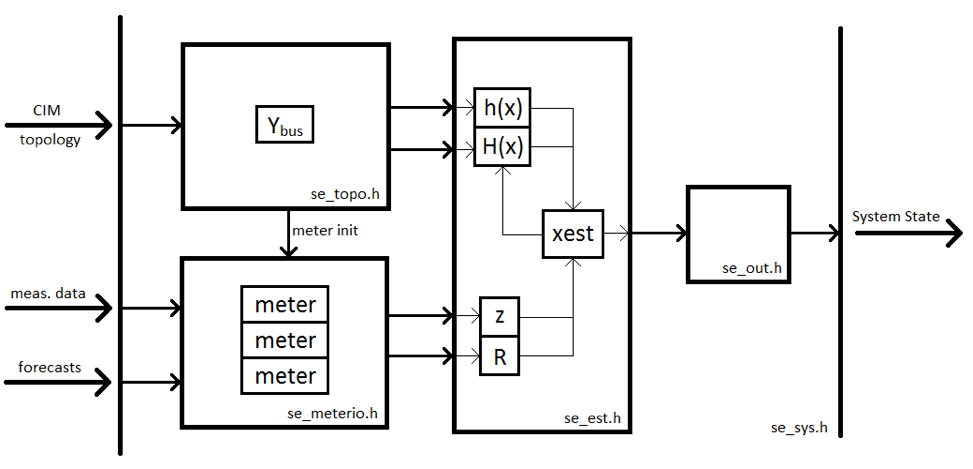
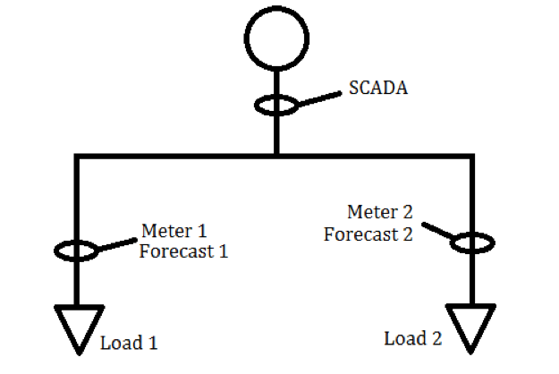
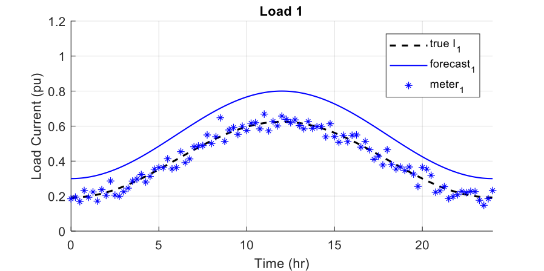
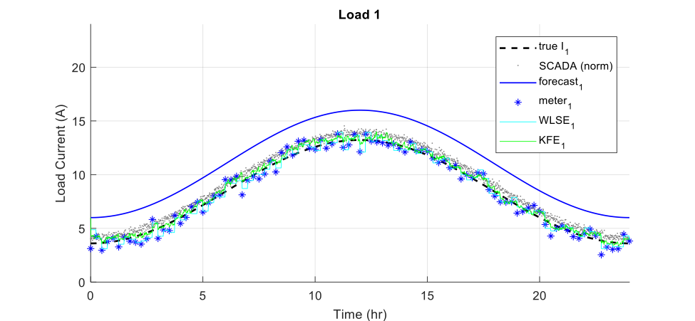
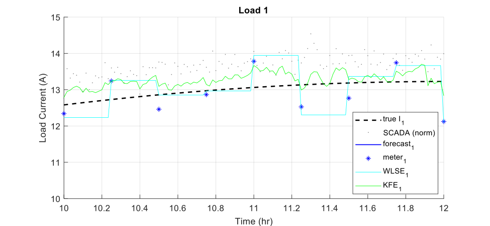
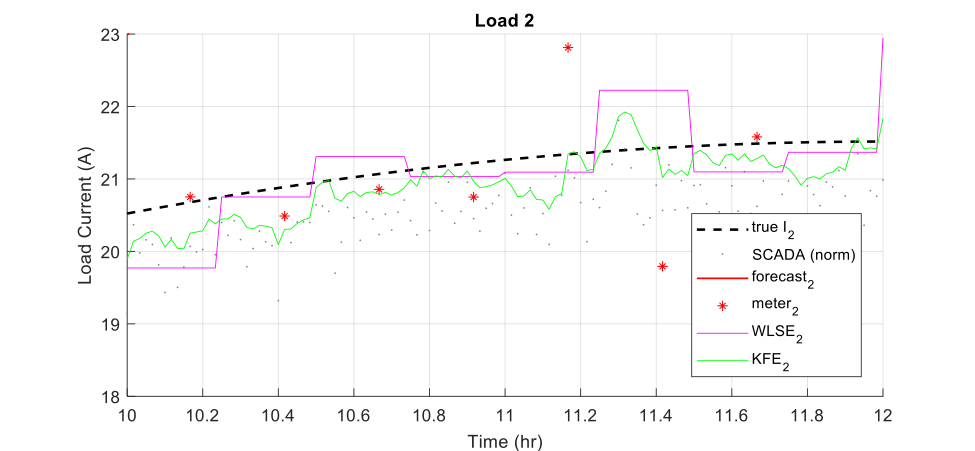

State Estimator
===============

Objectives
----------

Use case

Advanced distribution management platforms like GridAPPS-D open the door
to distribution system state estimators that are fast and accurate
enough to be useful to utility operations.

*Distribution System State Estimation Algorithms*

State estimation uses system model information to produce an estimate of
the state vector *x* given a measurement vector *z*. The measurement
vector is related to the state vector and an error vector by the
measurement function, which may be non-linear.

.. math:: z = h\left( x \right) + e

Multiple formulations of the distribution system state estimation
problem are possible:

1. *Node Voltage State Estimation (NVSE):* The state vector consists of
   node voltage magnitudes and angles for each node in the system (one
   reference angle can be eliminated from the state vector). This
   formulation of the state estimation problem is general to any
   topology and it is the standard for transmission system state
   estimation. It is compatible with any of the state estimation
   algorithms discussed below.

2. *Branch Current State Estimation (BCSE):* Radial topology and
   assumptions about shunt losses to create a linear formulation of the
   state estimation problem. The state vector contains branch currents
   and, for a fully-constrained problem, requires one state per load,
   which can be less than the number of branches in the system. BCSE is
   compatible with multiple state estimation algorithms discussed below.

Different algorithms provide different advantages for distribution
system state estimation:

1. *Weighted Least Squares Estimation (WLSE)*: a concurrent set of
   measurements are used to find a state vector that minimizes the
   weighted least squares objective function. The algorithm is
   memoryless with respect to previous solutions and measurements should
   be synchronized.

2. *Kalman Filter Estimation (KFE) and Extended Kalman Filter Estimation
   (EKFE)*: The Kalman filter provides a mechanism to consider past
   state estimates alongside present measurements. This provides
   additional noise rejection and allows asynchronous measurements can
   be considered individually. KFE is appropriate for linear BCSE and
   EKFE is compatible with nonlinear NVSE.

3. *Unscented Kalman Filter Estimation (UKFE)*: The unscented transform
   estimates the expected value and variance of the system state by
   observing the system outputs for inputs spanning the full
   dimensionality of the measurement space. Again, the Kalman filter
   provides a mechanism to consider past estimates.

TRL

The state estimation service for GridAPPS-D is being implemented in c++.
A flexible implementation allows different state estimation algorithms
to be implemented according to the following prioritized list:

1. BCSE using WLSE

2. BCSE using KFE and load forecasting

3. NVSE using EKFE and load forecasting

4. Simplified State Estimation, possibly BCSE using UKFE and load
   forecasting

*Switches and Tap Changers*

Switch and regulator tap positions can be considered continuous state
variables with discrete measurements.

*Simplified State Estimation*

Today distribution systems generally do not have enough meters to
produce the redundant measurements required to achieve a useful state
estimate. Load forecasts can be used as pseudo measurements to fill in
the gaps but precise forecasts of unmetered loads are unreliable. A
radial system with substation metering and full AMI coverage would
produce enough measurements for BCSE but even more meters would be
required for NVSE.

Distribution system model simplification can be used to eliminate nodes
without metering, reducing the order of a model and, thereby reducing
the number of measurements required for state estimation. Simplified
state estimation is being considered for this application.

Design
------

Overall work flow

The state estimation service is being developed in c++. A modular
structure allows the implementation of multiple state estimation
algorithms and enables the application to adapt to an evolving
interface. The program architecture is shown below.

|image0|

*Note: ownership of variables such as z and R may change.*

Most of the state estimator is contained within the se\_sys class. Four
internal objects perform the interface and state estimation functions of
the application:

-  *Topology Processor (se\_topo.h):* determines the measurement
   function and its Jacobian as well as meter type and location data.

   -  Inputs: Topological and parameter data from CIM database

   -  Outputs: measurement function h(x) and jacobian H(x), forward list
      of meters

-  *Meter Interface (se\_meterio.h):* Builds the measurement vector from
   raw measurement data.

   -  Inputs: measurements from json or other meter source

   -  Outputs: measurement vector z and diagonal covariance matrix R

-  *State Estimator (se\_est.h):* Estimates the system state from
   measurements.

   -  Inputs: h(x), H(x), z, R

   -  Outputs: state estimate xest, residual vector y (normalized)

-  *Output Module (se\_out.h):* returns the system state as determined
   by output interface requirements.

   -  Inputs: state estimate vector as returned by the state estimator

   -  Outputs: full complex system state

Data requirements

Message schemas (UML) (Enterprise Architect software)

Testing and Validation
----------------------

Evaluation metrics

-  Execution time

-  Bad data identified

-  Memory Leaked?

Scenarios

-  Time-series state estimation compared to QSTS simulations

-  Meter at every node to reproduce load-flow

-  Bad meter data (one and multiple meters)

-  

Prototype Testing

A prototype distribution system state estimator was developed in MATLAB.
Two branch-current-based algorithms were implemented: weighted least
squares estimation (WLSE), and Kalman filter estimation (KFE).

*Test System*

A three-bus test system was developed with two loads and up to five
measurements (including forecast pseudo measurements). A simple system
of this size allows different algorithms to be demonstrated under
different conditions, including bad meter data, asynchronous data, and
response to different true load shapes. The small system does not serve
as a stress test for many-bus state estimation. The prototype also does
not include bus voltage state estimation, or complex number handling.

|image1|

The test system has two states, corresponding to load currents.

.. math::

   x = \begin{bmatrix}
   I_{1} \\
   I_{2} \\
   \end{bmatrix}

The five measurements are indicated in the plot above:

.. math::

   z = \begin{bmatrix}
   \begin{matrix}
   \text{SCADA} \\
   \text{mete}r_{1} \\
   \end{matrix} \\
   \text{mete}r_{2} \\
   \begin{matrix}
   \text{forecas}t_{1} \\
   \text{forecas}t_{2} \\
   \end{matrix} \\
   \end{bmatrix}\ 

Because the problem is linear, the measurement function is equal to the
measurement Jacobian times the state vector.

.. math:: h\left( x \right) = Hx

For BCSE with complex current measurements, the measurement Jacobian is
constant and composed of ones and zeros. The measurement Jacobian of the
test system is shown below.

.. math::

   H = \begin{bmatrix}
   1 & 1 \\
   1 & 0 \\
   \begin{matrix}
   0 \\
   1 \\
   0 \\
   \end{matrix} & \begin{matrix}
   1 \\
   0 \\
   1 \\
   \end{matrix} \\
   \end{bmatrix}

*Synthetic Test Data Sets*

Synthetic measurements were used as inputs to the state estimator. The
following process was used to generate the synthetic measurements:

1. Determine the nominal or typical load shape for each load: a shifted
   cosine with a specified peak and a specified trough.

2. Set the forecast for each load to be equivalent to the nominal load
   with a specified standard deviation (e.g. half the span of the
   nominal load shape).

3. Generate synthetic “true” data for each load:

   a. Determine a global daily offset to represent common mode
      environmental effects.

   b. Determine a peak offset and a trough offset for each load.

   c. Each daily load shape is a shifted cosine with a peak equal to the
      nominal peak plus the global daily offset plus the local peak
      offset and a trough equal to the nominal trough plus the global
      daily offset plus the local trough offset.

4. Generate synthetic measurements: for each meter, at specified
   measurement intervals, sample the corresponding signal and add
   Gaussian noise with a specified standard deviation.

The plot below shows an example data set for load 1 current
:math:`I_{1}`, including “true” current, forecast, and meter 1 samples.

|image2|

In this scenario, the true current was lower than the forecast. The
meter reading is the true value plus Gaussian measurement error.

*Demonstration*

The series of plots below show performance of two branch-current-based
state estimation algorithms for a scenario on the test system.

|image3|

|image4|

By considering more data, state estimation matches the true state better
than individual meter readings. It is also possible to estimate states
where no meters are present. The KFE implementation uses an identity
state transition matrix, which considers previous state estimates and
resists transients.

|image5|

KFE can consider new meter readings as they become available. WLSE
requires a single data point for each measurement at each time step.
Because meters 1 and 2 are asynchronous, the state estimator uses the
most recent reading from each meter at each time step.

Operating/Running
-----------------

Configuration (aka inputs)

-  Algorithm Selection

-  Output Configuration?

Starting

References
----------

-  Abur and A. G. Exposito, *Power System State Estimation*, New York,
   NY: Marcel Dekker, Inc., 2004.

-  M. E. Baran and A. W. Kelley, "A branch-current-based state
   estimation method for distribution systems," in *IEEE Transactions on
   Power Systems*, vol. 10, no. 1, pp. 483-491, Feb 1995.

-  Z. Jia, J. Chen and Y. Liao, "State estimation in distribution system
   considering effects of AMI data," *2013 Proceedings of IEEE
   Southeastcon*, Jacksonville, FL, 2013, pp. 1-6.

-  S. C. Huang, C. N. Lu and Y. L. Lo, "Evaluation of AMI and SCADA Data
   Synergy for Distribution Feeder Modeling," in *IEEE Transactions on
   Smart Grid*, vol. 6, no. 4, pp. 1639-1647, July 2015.

-  M. Kettner; M. Paolone, "Sequential Discrete Kalman Filter for
   Real-Time State Estimation in Power Distribution Systems: Theory and
   Implementation," in *IEEE Transactions on Instrumentation and
   Measurement*, vol.PP, no.99, pp. 1-13, Jun. 2017.

-  G. Valverde and V. Terzija, "Unscented kalman filter for power system
   dynamic state estimation," in *IET Generation, Transmission &
   Distribution*, vol. 5, no. 1, pp. 29-37, Jan.

